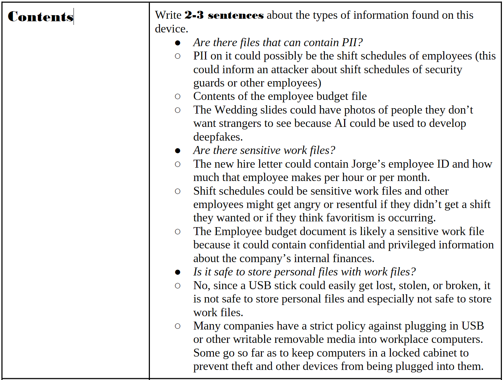

# Parking-Lot-USB
This is a portfolio activity that is part of the Coursera/Google Cybersecurity certification. It asks students to develop an "attacker mindset" for risks, threats, and vulnerabilities that could occur if someone (especially an employee or hacker) found a USB stick in the parking lot of a fictional Rhetorical Hospital.

## Table of Contents
* [Author](#Author)
* [Techologies](#Technologies)
* [Explaination](#Explaination)
* [Screenshots](#Screenshots)
* [Room for improvement](#Room-for-improvement)
* [Release date](#Release-date)
* [Contact](#Contact)

## Author
Jason Ash, Computer Science Major

## Technologies
I'm currently pursuing an online Cybersecurity Certification through Coursera/Google. I answered the questions to this parking lot USB exercise in LibreOffice and saved it as a PDF, resulting in a format that is more WYSIWYG for viewers. It can be viewed in any Web browser that can view PDF files or in Adobe Acrobat Reader.

## Explaination
- The prompts, such as write a certain number of sentences about this topic and the questions in italics after the solid bullet points, were provided by Coursera/Google in the assignment template.
- I wrote the answers to each question after the hollow bullet points.

## Screenshots

## Room for improvement
As I learn more about cybersecurity, I can revisit and improve my answers to the questions in this exercise.

## Release date
03 January 2026

## Contact
Jason Ash - wizardofki@gmail.com
